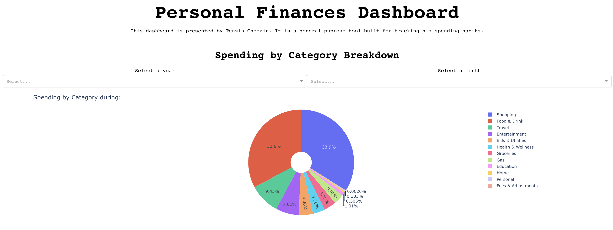

-----------------
# Personal Finances Dashboard
This program uses plotly's [dash](https://github.com/plotly/dash) library to visualize personal finances. It pulls all of its data from a single CSV file where all transactions are recorded and then reflected on the dashboard. 




## Usage
### Install Dependencies

```shell
import pandas as pd
import numpy as np 
import plotly.express as px
import plotly.graph_objects as go
import dash
from dash import Dash, dcc, html, Input, Output, dash_table, State
from datetime import date, datetime, timedelta
```

You probably want to install them with `pip` or `conda`.


### Adding your own data

In order to visualize your own finances, you'll have to find get transaction data in csv format and pass it into the cleandata function in the Dashboard.py application file.

### Running the application
```shell
python Dashboard.py
```

-----------------
<p align="left">
    
    
    
    
    
</p>

### Technologies used
* Python libraries - numpy, pandas, plotly, dash
* Version control - git 

### Tools and Services : 
* IDE - Vs code 
* Application deployment - Local server
* Code repository - GitHub
-----------------
